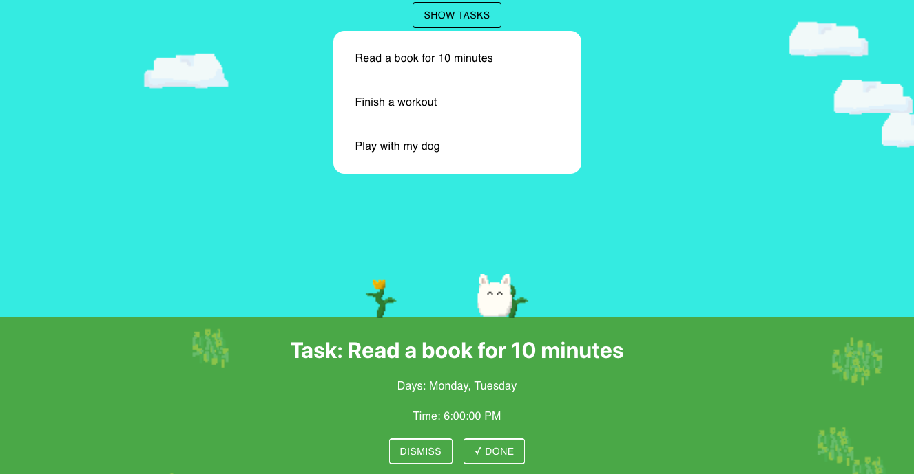

# tama-got-u

## Inspiration

1.2 million children and youth in Canada are affected by mental illness (CMHA). Common signs of mental distress and illness include decline in healthy habits and losing interest in hobbies and activities that a person once enjoyed. Tama-got-u emerged out of a desire to help users build healthy habits or re-discover habits they once enjoyed using a gamification strategy.

## What it does

Tama-got-u is a virtual pet that aids you in completing tasks. This helps you build positive habits through gamification. You take care of Tama-got-u by taking care of yourself. You are able to add tasks that suit your needs. Tama-got-u sends you reminders to complete tasks that you set. As you complete tasks, Tama-got-u thrives, its happiness increases, and the environment around it flourishes, providing positive reinforcement.

## How we built it

Our application is built upon a foundation of the React-Redux-Typescript combination. In addition to React, we’ve also included Redux and Typescript to really set the stage for an easily and highly scalable future. Our character was designed using HTML5 and brought to life using Javascript.
Overall, our current iteration is a simply designed and functional application that is built for the web, accessible using any modern device. We know that being able to reach a wide audience is paramount to our success, so we have woven usability into our design as our app is simple. Our backend stack is based on Firebase firestore and hosted on Firebase. This simple and well documented platform ensures that user data is secure, backend is easy to maintain and is scalable.

## Technologies used (Our Stack)

- React/Redux
- Firebase
- Typescript
- Javascript
- HTML5
- Material-UI library
- Node.js

## Challenges we ran into

- Accommodating different states of Tama-got-u into the environment.
- Making the environment interactive and changing it as users complete tasks or dismiss them.
- Complex data structure to keep track of different tasks, states of task and whether a reminder should be sent.

## Accomplishments that we are Proud Of

- Creating a well-integrated design that is visually appealing and easy to use.
- Ability to change the state of the pet based on task completion.
- Functionality to add tasks and change the time of the notification.

## What we learned

Through the process of developing Tama-got-u for Hack the Change 2021, we learned numerous skills that will help our team in future projects we pursue, whether that be through school, work, or another hackathon.

- Prioritization and time management of features that are essential to our project and judging.
- Git and project management skills in a fast paced team environment
- Debugging web apps and Firebase.

## What’s Next for Tama-got-u

As we further develop Tama-got-u we hope to improve on some current implementations and develop additional features:

- A caregiver portal to give parents and Health care practitioners (HCPs) the ability to customize Tama-got-u’s tasks.
- History and streaks for increased motivation.
- Customizable pet types.
- Increased number of pet states.
